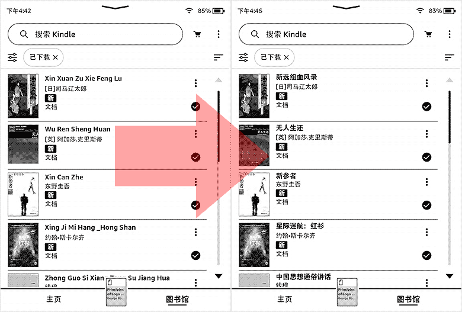

# Send To Kindle Calibre Plugin

A plugin for you to send ebook with the desired title.

---

## Installation

Please make sure __[Calibre](https://calibre-ebook.com/)__ is installed on your OS, and install the plugin via either ways below:

1. Download the plugin zip file from __[releases page](https://github.com/bookfere/Send-to-Kindle-Calibre-Plugin/releases)__.
2. Click Calibre Menu __[Preference... → Plug-ins → Load plug-in from file]__, and choose the zip file you downloaded.
3. Reboot Calibre.

If you want to install the latest plugin, run the following commands to download the latest plugin file from GitHub repository:

<pre><code>git clone https://github.com/bookfere/Send-to-Kindle-Calibre-Plugin.git
cd Send-to-Kindle-Calibre-Plugin
git archive --format zip --output ../Send-to-Kindle-Calibre-Plugin.zip master</code></pre>

If the "Send to Kindle" plugin is not showing up on Calibre menu, you need to add it from __[Preference... → Toolbars & menus]__, choose __[The main toolbar]__, find the plugin and click __[>]__, and __[Apply]__.

---

## Usage

1. Select the ebook(s), and click the plugin icon "Send to Kindle".
2. Modify the title of the ebook(s) to your desired title.
3. Click __[Send to Kindle]__ button.

After that, you can check the sending process by clicking "Jobs" at the bottom right.

---

## License

[GNU General Public License v3.0](https://www.gnu.org/licenses/gpl-3.0.en.html)

---

* GitHub：[https://github.com/bookfere/Send-to-Kindle-Calibre-Plugin](https://github.com/bookfere/Send-to-Kindle-Calibre-Plugin)
* Releases：[https://bookfere.com/post/1042.html](https://bookfere.com/post/1042.html)
* Donate：[https://bookfere.com/donate](https://bookfere.com/donate)
